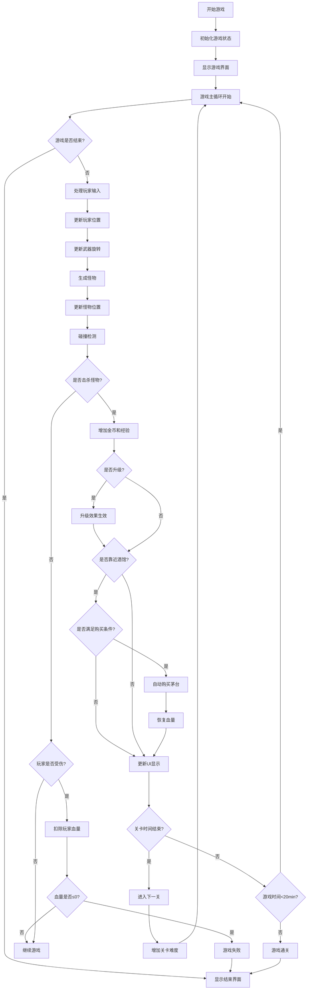
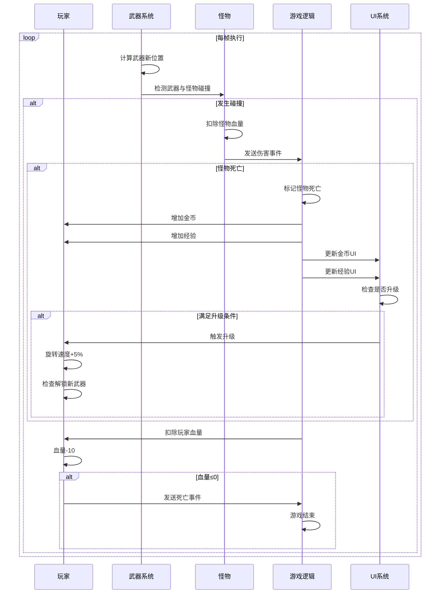
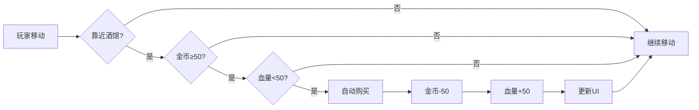

# 🎮 KungfuMaster 游戏产品需求文档 (PRD)

**版本**: V1.0
**状态**: 待确认
**创建日期**: 2025-12-23

---

## 目录

1. [核心目标](#核心目标)
2. [用户画像](#用户画像)
3. [V1: 最小可行产品](#v1-最小可行产品)
4. [V2 及以后版本](#v2-及以后版本)
5. [关键业务规则](#关键业务规则)
6. [数据契约](#数据契约)
7. [MVP 原型设计](#mvp-原型设计)
8. [架构设计蓝图](#架构设计蓝图)

---

## 核心目标 (Mission)

打造一款**解压好玩的2D俯视卡通风割草游戏**，玩家扮演武僧通过旋转武器消灭不断逼近的怪物，坚持20分钟通关，体验不断成长与割草的快感。

**核心价值观**：
- ✅ 操作极简（方向键/WASD）
- ✅ 割草快感（旋转武器自动攻击）
- ✅ 成长体验（升级解锁、速度加快）
- ✅ 关卡挑战（20分钟紧凑体验）

---

## 用户画像 (Persona)

### 目标用户画像

**基础属性**：
- **年龄段**: 18-35岁
- **职业**: 学生、上班族、业余玩家
- **游戏偏好**: 喜欢解压游戏、割草类游戏、吸血鬼幸存者类
- **游戏习惯**: 碎片时间娱乐（通勤、午休、睡前），单次游戏时长20-30分钟

**核心痛点**：
- ❌ 传统大作操作复杂、学习成本高
- ❌ 缺乏随时可玩、可暂停的轻度游戏
- ❌ 工作压力大，需要简单粗暴的解压方式
- ❌ 想要割草快感但找不到合适的移动端/PC端游戏

**行为特征**：
- 喜欢"无脑"操作的游戏
- 追求快速获得成就感
- 对数值成长有强烈偏好
- 倾向于重复游玩以追求更高分数

### 用户故事 (User Stories)

**作为**一个忙碌的上班族，
**我希望**在工作间隙能快速玩一把解压游戏，
**以便**释放压力、放松心情。

**作为**一个游戏新手，
**我希望**操作简单、上手容易，
**以便**不需要复杂的学习就能获得游戏乐趣。

**作为**一个数值养成爱好者，
**我希望**看到角色不断变强、武器越来越多，
**以便**获得持续的成长满足感。

---

## V1: 最小可行产品 (MVP)

### 1. 游戏概述

**游戏类型**: 2D俯视视角割草游戏
**美术风格**: 卡通风
**操作方式**: 键盘方向键 / WASD
**游戏时长**: 20分钟（10关 × 2分钟/关）
**架构模式**: 前后端分离（同机运行）

### 2. 核心功能清单

#### 2.1 游戏场景

- **视角**: 2D俯视视角
- **初始位置**: 玩家在屏幕中央
- **地图**: 有限封闭空间，怪物从边缘生成
- **固定设施**: 3个酒馆（固定坐标分布）

#### 2.2 玩家系统

**角色属性**：
- 角色名称: 武僧
- 初始血量: 100/100 (满血)
- 移动速度: 适中（手动控制）
- 初始等级: 1级
- 初始金币: 0
- 初始杀怪数: 0
- 初始武器数: 5把

**受伤机制**：
- 触发条件: 玩家身体碰到怪物
- 伤害数值: -10 血量/次
- 无闪避/无敌帧机制

#### 2.3 武器系统

**武器类型**: 长剑

**核心属性**：
- 初始数量: 3把
- 最大数量: 6把
- 旋转方向: 顺时针
- 旋转速度: 初始 0.3 圈/秒，每级 +5%
- 环绕距离: 固定距离围绕玩家
- 伤害数值: 10 伤害/次
- 分布方式: 均匀分布在360度圆周上

**升级规则**：
- 解锁条件: 每2级解锁1把新剑
- 解锁上限: 14级时达到12把 (5初始 + 7解锁)
- 速度加成: 每升1级，旋转速度 +5%
- 自动触发: 无需玩家选择，到级自动增强

#### 2.4 敌人系统

|**4种怪物类型**：

|| 怪物类型 | 外观标识 | 移动速度 | 血量 | 伤害 | 金币掉落 | 特点描述 |
||---------|---------|---------|------|------|---------|---------|
|| 哥布林 | 🟢 绿色 | 170px/s | 12 | 8 | 1-3金币 | 普通敌人，数量最多 |
|| 蝙蝠 | 🦇 黑色 | 180px/s | 10 | 8 | 1-3金币 | 速度快，难追击 |
|| 骷髅 | 💀 白色 | 160px/s | 25 | 8 | 1-3金币 | 血厚但移动中等 |
|| 妖怪4 | 🔴 红色 | 190px/s | 15 | 10 | 1-3金币 | 速度最快，伤害最高 |

**生成机制**：
- 生成位置: 屏幕边缘随机位置
- 移动方式: 追踪玩家（直接朝玩家当前位置移动）
- 生成频率: 根据关卡难度递增
- 难度曲线: 每关怪物密度和生成率递增

**战斗判定**：
- 判定方式: 武器接触怪物即造成伤害
- 伤害频率: 武器每转一圈，每把剑接触怪物N次（根据帧率和旋转速度计算）
- 死亡条件: 怪物血量 ≤ 0

#### 2.5 升级系统

**等级机制**：
- 初始等级: 1级
- 等级上限: 暂无限制（根据游戏时长）
- 等级显示: 玩家可见

**经验获取**：
- 经验来源: 击杀怪物（获得最后一击的怪物）
- 经验数值: 1怪 = 1经验

**经验曲线**（递增方案）：
- 1级→2级: 10只怪
- 2级→3级: 12只怪
- 3级→4级: 14只怪
- ...以此类推，每级递增2只怪
- 公式: 所需经验 = 10 + (当前等级 - 1) × 2

**升级效果**（自动触发）：
- 旋转速度 +5%
- 解锁新武器（每2级）
- 无需玩家选择

#### 2.6 经济系统

**金币获取**：
- 获取方式: 击杀怪物掉落
- 掉落数量: 根据怪物类型1-5金币（固定值，非随机）
- 金币类型: 当局有效（游戏结束清零）

**金币消费**：
- 消费场景: 酒馆购买茅台
- 消费金额: 50金币/瓶
- 找零规则: 无（不足50金币不可购买）

**初始状态**：
- 初始金币: 0

#### 2.7 酒馆系统

**酒馆配置**：
- 酒馆数量: 3个
- 位置分布: 固定坐标
  - 酒馆A: 左上角区域
  - 酒馆B: 右上角区域
  - 酒馆C: 底部中央区域

**商品信息**：
- 商品名称: 茅台
- 价格: 50金币
- 效果: 恢复50点血量
- 恢复上限: 不超过最大血量(100)

**购买机制**：
- 触发条件: 玩家靠近酒馆（进入交互范围）
- 自动判断: 系统自动检测是否满足购买条件
- 购买条件: ① 金币 ≥ 50 ② 当前失血量 > 50（即血量 < 50）
- 自动执行: 满足条件自动购买，无需手动操作
- 购买后: 金币-50，血量+50

**显示方式**：
- 酒馆图标: 永久可见
- 购买提示: 满足条件时显示购买提示
- 状态显示: 显示茅台库存或购买次数

#### 2.8 关卡系统

**关卡结构**：
- 总关卡数: 10关
- 每关时长: 2分钟
- 总游戏时长: 20分钟
- 通关条件: 坚持20分钟（完成第10关）

**关卡进度**：
- 进度显示: UI显示当前关卡 (1/10)
- 时间显示: UI显示本关剩余时间 / 总时间

**难度设计**：
- 难度递增: 每关怪物生成率和密度递增
- 第1-3关: 基础难度，适合热身
- 第4-6关: 中等难度，怪物类型混合
- 第7-9关: 高难度，怪物密集
- 第10关: 最高难度，终极挑战

**关卡切换**：
- 切换方式: 时间自动切换（每2分钟）
- 切换提示: 屏幕显示"第X关"提示
- 难度衔接: 无缝切换，难度平滑过渡

#### 2.9 游戏流程

**游戏开始**：
1. 玩家进入游戏界面
2. 点击"开始游戏"
3. 玩家出现在屏幕中央（满血100/100）
4. 倒计时3秒后游戏开始
5. 武器开始旋转，怪物开始生成

**游戏进行**：
1. 玩家移动（WASD/方向键）
2. 武器自动旋转并攻击怪物
3. 击杀怪物获得金币和经验
4. 玩家被怪物碰到扣血
5. 玩家靠近酒馆自动购买茅台回血
6. 玩家升级（自动增强武器）
7. 关卡时间结束自动进入下一关

**游戏结束**：
- **胜利条件**: 完成10关（坚持20分钟）
  - 显示"通关成功"
  - 显示通关数据（杀怪数、金币、等级）
  - 提供"再来一局"按钮
- **失败条件**: 血量归零（≤0）
  - 显示"游戏结束"
  - 显示死亡数据（杀怪数、金币、等级、通关进度）
  - 提供"重新开始"按钮

#### 2.10 UI界面设计

**HUD元素**（游戏内实时显示）：
- ✅ **血条**: 顶部中央，100点满值，可视化显示（心形或血槽）
- ✅ **金币数**: 左上角，显示当前金币数量
- ✅ **等级**: 玩家头顶或左上角，显示当前等级
- ✅ **杀怪数**: 左上角或顶部，显示累计击杀数量
- ✅ **游戏时间**: 顶部中央，显示当前关卡剩余时间和总进度
- ✅ **武器数量**: 玩家头顶或UI面板，显示当前武器数量 (3/6)
- ✅ **当前关卡**: 顶部显示 (1/10)

**界面风格**:
- 卡通可爱风格
- 图标清晰可辨
- 信息层次分明
- 重要信息高亮显示

---

## V2 及以后版本 (Future Releases)

### 短期扩展 (V2)

**武器系统扩展**：
- 🎨 更多武器类型
  - 飞斧（远程投掷）
  - 回旋镖（往返攻击）
  - 魔法法杖（元素伤害）
- 🔄 武器组合系统（多武器类型共存）
- ✨ 武器皮肤/外观

**怪物系统扩展**：
- 👾 精英怪物（更高血量，特殊外观）
- 🏆 限时Boss（每关出现一次的强敌）
- 📈 更多怪物类型（元素怪、飞行怪等）

**玩家系统扩展**：
- 🛡️ 防具系统（增加抗性、减伤）
- 💍 饰品系统（特殊属性加成）
- ⭐ 闪避机制（增加无敌帧，可通过道具解锁）

**经济系统扩展**：
- 🏪 酒馆商品多样化
  - 恢复道具（小红药、大红药）
  - 增益道具（攻击加速、临时无敌）
  - 解锁道具（新武器试用）
- 💰 永久金币（局外养成元素）

### 中期扩展 (V3)

**游戏内容**：
- 🗺️ 多张地图（森林、沙漠、冰原等）
- 🌙 昼夜系统（白天/夜晚不同怪物）
- ⛈️ 天气系统（雨、雪影响游戏性）
- 🎯 每日任务系统
- 🏆 成就系统

**社交功能**：
- 📊 排行榜系统（杀怪数、通关时间、存活时长）
- 👥 多人联机模式（合作割草）
- 💬 玩家互动（表情、动作）

**技术增强**：
- 🎵 音效系统（背景音乐、环境音、打击音效）
- 📱 触屏操作支持（移动端适配）
- 🎮 手柄支持

### 长期扩展 (V4+)

**深度内容**：
- 🏰 故事模式（剧情推进）
- 🎭 多角色系统（不同技能树）
- 🔧 局外养成系统（永久属性提升）
- 🏹roguelike元素（随机技能选择）

**平台扩展**：
- 💻 PC端完整版
- 📱 移动端（iOS/Android）
- 🌐 网页版

**商业模式**：
- 💎 皮肤商城
- 🎁 付费DLC
- 🪙 抽卡系统（武器/角色）

---

## 关键业务规则 (Business Rules)

### 战斗规则

1. **自动攻击**: 武器自动旋转攻击，无需玩家操作
2. **受伤判定**: 怪物碰到玩家身体即扣血，无闪避机制
3. **伤害计算**: 武器每次接触怪物造成固定10点伤害
4. **击杀判定**: 怪物血量 ≤ 0 时死亡

### 成长规则

5. **经验获取**: 只有造成最后一击的玩家获得经验
6. **升级触发**: 经验达标自动升级，无需玩家确认
7. **属性加成**: 升级立即生效（速度+5%，或解锁武器）
8. **武器解锁**: 达到等级自动解锁新武器，无需购买

### 经济规则

9. **金币获取**: 击杀怪物固定获得金币（非随机）
10. **金币使用**: 仅限当局使用，退出游戏清零
11. **酒馆消费**: 自动判断并执行，无需手动购买
12. **血量恢复**: 仅可通过茅台恢复，有条件限制

### 游戏进程规则

13. **时间驱动**: 游戏进程由时间控制，非关卡目标
14. **关卡切换**: 时间到达自动切换，无缝衔接
15. **难度递增**: 每关难度明确递增，可预测
16. **胜利条件**: 存活20分钟即通关，无额外条件

### 失败规则

17. **死亡判定**: 血量 ≤ 0 时游戏立即结束
18. **无复活机制**: 死亡后需重新开始
19. **数据保存**: 当局数据游戏结束后清除

### 交互规则

20. **酒馆触发**: 玩家进入酒馆交互范围自动触发
21. **自动购买**: 满足条件自动执行，不需手动确认
22. **购买限制**: 不满足任一条件则不购买

---

## 数据契约 (Data Contract)

### 1. 玩家状态数据 (Player State)

```typescript
interface PlayerState {
  // 基础标识
  playerId: string;           // 玩家唯一标识
  playerName: string;         // 玩家名称

  // 生命值
  currentHp: number;          // 当前血量 (0-100)
  maxHp: number;              // 最大血量 (固定100)

  // 经济
  gold: number;               // 当前金币 (当局有效)

  // 等级系统
  level: number;              // 当前等级 (初始1)
  currentExp: number;         // 当前经验值
  expToNextLevel: number;     // 下一级所需经验

  // 武器系统
  weaponsCount: number;       // 当前武器数量 (3-6)
  rotationSpeed: number;      // 旋转速度 (圈/秒)

  // 战绩
  killCount: number;          // 杀怪总数
  gameTime: number;           // 游戏时长(秒)

  // 进度
  currentStage: number;       // 当前关卡 (1-10)
  stageTime: number;          // 当前关卡已用时间(秒)

  // 状态
  isAlive: boolean;           // 是否存活
  isPaused: boolean;          // 是否暂停
}
```

### 2. 武器数据 (Weapon)

```typescript
interface Weapon {
  // 基础属性
  weaponId: number;           // 武器唯一ID
  weaponType: 'sword';        // 武器类型

  // 位置属性
  angle: number;              // 当前角度(弧度)
  distance: number;           // 环绕距离(像素)

  // 战斗属性
  damage: number;             // 单次伤害 (固定10)
  rotationSpeed: number;      // 旋转速度

  // 状态
  isActive: boolean;          // 是否激活
  unlockLevel: number;        // 解锁所需等级
}
```

### 3. 怪物数据 (Monster)

```typescript
interface Monster {
  // 基础属性
  monsterId: string;          // 怪物唯一标识
  monsterType: 'goblin' | 'bat' | 'skeleton';  // 怪物类型

  // 战斗属性
  currentHp: number;          // 当前血量
  maxHp: number;              // 最大血量
  damage: number;             // 对玩家伤害 (固定10)

  // 移动属性
  speed: number;              // 移动速度
  targetPosition: {           // 目标位置
    x: number;
    y: number;
  };

  // 位置属性
  position: {                 // 当前位置
    x: number;
    y: number;
  };

  // 经济属性
  goldDrop: number;           // 掉落金币数

  // 状态
  isAlive: boolean;           // 是否存活
  spawnTime: number;          // 生成时间(游戏时间戳)
}
```

### 4. 酒馆数据 (Tavern)

```typescript
interface Tavern {
  // 基础属性
  tavernId: string;           // 酒馆唯一标识
  tavernName: string;         // 酒馆名称

  // 位置属性
  position: {                 // 酒馆位置
    x: number;
    y: number;
  };
  interactionRange: number;   // 交互范围半径

  // 商品配置
  items: {
    itemId: string;           // 商品ID
    itemName: 'maotai';       // 商品名称
    price: number;            // 价格 (50)
    healAmount: number;       // 恢复血量 (50)
    maxHeal: number;          // 单次最大恢复
  }[];

  // 状态
  isActive: boolean;          // 是否激活
  purchaseCount: number;      // 购买次数
}
```

### 5. 关卡配置 (Stage)

```typescript
interface StageConfig {
  // 基础配置
  stageId: number;            // 关卡ID (1-10)
  stageName: string;          // 关卡名称
  duration: number;           // 关卡时长(秒) = 120

  // 难度配置
  spawnRate: number;          // 怪物生成率 (怪/秒)
  spawnRateMultiplier: number;// 生成率倍率 (每关递增)
  monsterDensity: number;     // 怪物密度
  monsterTypes: string[];     // 允许生成的怪物类型

  // 环境配置
  backgroundColor: string;    // 背景颜色
}
```

### 6. 游戏配置 (GameConfig)

```typescript
interface GameConfig {
  // 基础设置
  totalStages: number;        // 总关卡数 (10)
  stageDuration: number;      // 每关时长(秒) = 120
  totalGameTime: number;      // 总游戏时长(秒) = 1200

  // 玩家配置
  player: {
    startHp: number;          // 初始血量 = 100
    maxHp: number;            // 最大血量 = 100
    damagePerHit: number;     // 每次受伤扣血 = 10
    startWeapons: number;     // 初始武器数 = 5
    maxWeapons: number;       // 最大武器数 = 12
    startRotationSpeed: number; // 初始旋转速度 = 0.5
    speedIncreasePerLevel: number; // 每级速度加成 = 0.05
    weaponsUnlockInterval: number; // 武器解锁间隔(级) = 2
  };

  // 武器配置
  weapon: {
    damage: number;           // 武器伤害 = 10
    distance: number;         // 环绕距离
    rotationDirection: 'clockwise'; // 旋转方向
  };

  // 怪物配置
  monsters: {
    goblin: {
      hp: number;             // 血量 = 10
      damage: number;         // 伤害 = 10
      speed: number;          // 速度
      goldDropMin: number;    // 最小掉落 = 1
      goldDropMax: number;    // 最大掉落 = 2
    };
    bat: {
      hp: number;             // 血量 = 8
      damage: number;         // 伤害 = 10
      speed: number;          // 速度（快）
      goldDropMin: number;    // 最小掉落 = 2
      goldDropMax: number;    // 最大掉落 = 3
    };
    skeleton: {
      hp: number;             // 血量 = 20
      damage: number;         // 伤害 = 10
      speed: number;          // 速度（中）
      goldDropMin: number;    // 最小掉落 = 3
      goldDropMax: number;    // 最大掉落 = 5
    };
  };

  // 经济配置
  economy: {
    taikernPrice: number;     // 茅台价格 = 50
    taikernHeal: number;      // 茅台恢复 = 50
    healThreshold: number;    // 购买门槛(血量<50)
  };

  // 升级配置
  leveling: {
    startExpRequired: number; // 1级升2级所需 = 10
    expIncreasePerLevel: number; // 每级递增 = 2
  };

  // 酒馆位置
  taverns: {
    tavernA: { x: number; y: number };
    tavernB: { x: number; y: number };
    tavernC: { x: number; y: number };
  };
}
```

### 7. 游戏事件 (Game Events)

```typescript
// 游戏状态变更事件
type GameEvent =
  | { type: 'PLAYER_MOVE'; position: { x: number; y: number } }
  | { type: 'PLAYER_HURT'; damage: number; newHp: number }
  | { type: 'PLAYER_HEAL'; amount: number; newHp: number }
  | { type: 'MONSTER_SPAWN'; monster: Monster }
  | { type: 'MONSTER_DIE'; monsterId: string; goldDrop: number; expGain: number }
  | { type: 'WEAPON_ATTACK'; weaponId: number; targetId: string; damage: number }
  | { type: 'PLAYER_LEVEL_UP'; newLevel: number; newSpeed: number; newWeaponsCount: number }
  | { type: 'STAGE_COMPLETE'; stage: number }
  | { type: 'GAME_WIN' }
  | { type: 'GAME_LOSE' }
  | { type: 'TAVERN_PURCHASE'; tavernId: string; item: string; cost: number };
```

---

## MVP 原型设计

*待用户确认原型图后补充*

### 原型理念1: [待命名]
*此处将插入ASCII原型图*

### 原型理念2: [待命名]
*此处将插入ASCII原型图*

### 原型理念3: [待命名]
*此处将插入ASCII原型图*

---

## 架构设计蓝图

### 1. 系统架构概览

```
┌─────────────────────────────────────────────────────────────────┐
│                         游戏架构顶层设计                          │
├─────────────────────────────────────────────────────────────────┤
│                                                                 │
│  ┌─────────────┐     ┌─────────────┐     ┌─────────────┐       │
│  │   前端 UI   │     │   业务逻辑  │     │   后端服务  │       │
│  │   渲染层    │◄───►│   控制器    │◄───►│   核心引擎  │       │
│  └─────────────┘     └─────────────┘     └─────────────┘       │
│         │                   │                   │              │
│         └───────────────────┼───────────────────┘              │
│                             ▼                                  │
│                    ┌─────────────────┐                         │
│                    │   游戏状态管理  │                         │
│                    │   (数据层)      │                         │
│                    └─────────────────┘                         │
│                                                                 │
└─────────────────────────────────────────────────────────────────┘
```

### 2. 核心流程图

#### 2.1 游戏主循环流程



#### 2.2 战斗碰撞流程



#### 2.3 酒馆购买流程



### 3. 组件交互说明

#### 3.1 前端组件

```
┌────────────────────────────────────────────────────────────────┐
│                        前端组件架构                             │
├────────────────────────────────────────────────────────────────┤
│                                                                │
│  ┌────────────────────────────────────────────────────────┐  │
│  │                   GameContainer                        │  │
│  │  (游戏主容器，管理整个游戏界面)                          │  │
│  └────────────────────────────────────────────────────────┘  │
│                           │                                    │
│         ┌─────────────────┼─────────────────┐                │
│         ▼                 ▼                 ▼                │
│  ┌─────────────┐   ┌─────────────┐   ┌─────────────┐        │
│  │   Canvas    │   │    HUD      │   │  Overlay    │        │
│  │  (游戏画布)  │   │  (抬头显示)  │   │  (弹窗层)   │        │
│  │             │   │             │   │             │        │
│  │ ┌─────────┐ │   │ ┌─────────┐ │   │ ┌─────────┐ │        │
│  │ │Player   │ │   │ │HpBar    │ │   │ │StartScreen│        │
│  │ │Renderer │ │   │ │GoldDisp │ │   │ │GameOverScreen│     │
│  │ │Monster  │ │   │ │LevelDisp│ │   │ │PauseScreen│      │
│  │ │Renderer │ │   │ │KillDisp │ │   │ │StageComplete│     │
│  │ │Weapon   │ │   │ │TimeDisp │ │   │ └─────────┘ │        │
│  │ │Renderer │ │   │ │WeapCount│ │   │             │        │
│  │ │Tavern   │ │   │ │StageDisp│ │   │             │        │
│  │ │Renderer │ │   │ └─────────┘ │   │             │        │
│  │ └─────────┘ │   │             │   │             │        │
│  └─────────────┘   └─────────────┘   └─────────────┘        │
│                                                                │
└────────────────────────────────────────────────────────────────┘
```

#### 3.2 后端模块

```
┌────────────────────────────────────────────────────────────────┐
│                       后端模块架构                              │
├────────────────────────────────────────────────────────────────┤
│                                                                │
│  ┌────────────────────────────────────────────────────────┐  │
│  │                  GameEngine                            │  │
│  │  (游戏引擎主控制器)                                      │  │
│  └────────────────────────────────────────────────────────┘  │
│                           │                                    │
│  ┌─────────────┬─────────┼─────────┬─────────────┐           │
│  ▼             ▼         ▼         ▼             ▼           │
│ ┌──────┐ ┌────────┐ ┌────────┐ ┌────────┐ ┌──────────┐     │
│ │Player│ │Weapon  │ │Monster │ │Tavern  │ │Leveling  │     │
│ │Manager│ │System  │ │System  │ │System  │ │System    │     │
│ └──────┘ └────────┘ └────────┘ └────────┘ └──────────┘     │
│      │       │        │        │           │               │
│      └───────┼────────┴────────┼───────────┘               │
│              ▼                  ▼                           │
│        ┌─────────────┐    ┌─────────────┐                  │
│        │Collision    │    │GameState    │                  │
│        │Detector     │    │Manager      │                  │
│        │(碰撞检测)    │    │(状态管理)   │                  │
│        └─────────────┘    └─────────────┘                  │
│                                                                │
└────────────────────────────────────────────────────────────────┘
```

#### 3.3 模块调用关系

**初始化阶段**：
```
GameEngine.start()
  ├── PlayerManager.initialize()
  ├── WeaponSystem.initialize(initialWeapons: 5)
  ├── MonsterSystem.initialize()
  ├── TavernSystem.initialize(3 taverns)
  ├── LevelingSystem.initialize()
  └── GameStateManager.reset()
```

**游戏循环 (每帧)**：
```
GameEngine.update(deltaTime)
  ├── InputHandler.processInput()  // 处理玩家输入
  ├── PlayerManager.update()       // 更新玩家位置
  ├── WeaponSystem.update()        // 更新武器旋转
  ├── MonsterSystem.update()       // 更新怪物AI
  ├── CollisionDetector.check()    // 碰撞检测
  │   ├── WeaponMonsterCollision   // 武器vs怪物
  │   ├── PlayerMonsterCollision   // 玩家vs怪物
  │   └── PlayerTavernCollision    // 玩家vs酒馆
  ├── LevelingSystem.update()      // 检查升级
  ├── TavernSystem.checkPurchase() // 检查酒馆购买
  └── GameStateManager.update()    // 更新游戏状态
```

**关键事件流**：

1. **玩家移动**：
   ```
   Input → PlayerManager → Player.position
   ```

2. **武器攻击**：
   ```
   WeaponSystem.rotation → CollisionDetector → Monster.hp--
   → MonsterSystem.removeIfDead() → LevelingSystem.addExp()
   ```

3. **玩家受伤**：
   ```
   CollisionDetector → Player.hp -= 10
   → GameStateManager.checkGameOver()
   ```

4. **酒馆购买**：
   ```
   CollisionDetector → TavernSystem.checkCondition()
   → (gold>=50 && hp<50) → Player.gold -= 50
   → Player.hp += 50
   ```

5. **升级触发**：
   ```
   LevelingSystem → exp >= required
   → Player.rotationSpeed += 5%
   → (level%2==0) ? WeaponSystem.addWeapon() : null
   ```

#### 3.4 数据流向

```
┌─────────────────────────────────────────────────────────────────┐
│                        数据流向图                               │
├─────────────────────────────────────────────────────────────────┤
│                                                                 │
│   输入设备          前端                 后端                  │
│   ┌───────┐        ┌──────────┐        ┌───────────┐          │
│   │键盘/  │        │  Canvas  │        │GameEngine │          │
│   │鼠标   │───────►│ Renderer │◄───────│           │          │
│   └───────┘        │          │        │           │          │
│                    └────┬─────┘        │    ┌──────┴───┐      │
│                         │              │    │          │      │
│                         ▼              │    ▼          │      │
│                    ┌──────────┐        │ ┌────────┐  │        │
│                    │  HUD     │        │ │ Managers│  │        │
│                    │  Display │◄───────│ │        │  │        │
│                    └──────────┘        │ └────┬───┘  │        │
│                                         │     │      │        │
│                                         ▼     ▼      │        │
│                                    ┌──────────────┐  │        │
│                                    │  GameState   │  │        │
│                                    │  (Single     │  │        │
│                                    │   Source of  │──┘        │
│                                    │   Truth)     │           │
│                                    └──────────────┘           │
│                                                                 │
└─────────────────────────────────────────────────────────────────┘
```

### 4. 技术选型与风险

#### 4.1 推荐技术栈

**前端技术**：

| 层级 | 技术选择 | 理由 |
|-----|---------|------|
| **渲染引擎** | HTML5 Canvas + 原生JS | 轻量级、跨平台、性能足够 |
| **框架** | 原生JavaScript (ES6+) | 游戏逻辑简单，不需要框架开销 |
| **状态管理** | 自定义状态机 | 游戏状态清晰，易于管理 |
| **构建工具** | Vite | 开发体验好，快速启动 |

**备选方案**：
- Phaser.js: 更强大的游戏框架，适合复杂游戏
- PixiJS: 高性能2D渲染，适合大量精灵
- Unity WebGL: 如果需要更复杂的功能

**后端技术**：

| 层级 | 技术选择 | 理由 |
|-----|---------|------|
| **运行环境** | Node.js | 与前端同语言，开发效率高 |
| **框架** | Express.js | 轻量级，简单易用 |
| **架构模式** | 同机运行（进程通信） | 简单场景，避免网络延迟 |
| **游戏逻辑** | 前后端分离，但同进程 | 代码清晰，职责分明 |

**备选方案**：
- Python (Flask/FastAPI): 如果后端逻辑复杂
- Go: 如果需要高性能计算

#### 4.2 核心算法

**碰撞检测**：
- **圆形碰撞检测**（玩家、武器、怪物都是圆形）
- 算法：检测两个圆心的距离是否 ≤ 半径之和
- 复杂度：O(1) 每对检测
- 优化：空间分区（四叉树）或简单距离过滤

```javascript
function checkCircleCollision(obj1, obj2) {
  const dx = obj1.x - obj2.x;
  const dy = obj1.y - obj2.y;
  const distance = Math.sqrt(dx * dx + dy * dy);
  return distance <= (obj1.radius + obj2.radius);
}
```

**武器旋转计算**：
- 极坐标系转换
- 公式：`x = player.x + distance × cos(angle)`
- 公式：`y = player.y + distance × sin(angle)`

**怪物追踪算法**：
- 向量追踪
- 计算方向向量：`(player.x - monster.x, player.y - monster.y)`
- 归一化后乘以速度

**经验曲线**：
- 公式：`expToNextLevel = 10 + (level - 1) × 2`

#### 4.3 性能优化策略

**渲染优化**：
- 对象池（Object Pool）：复用怪物、武器对象
- 脏矩形渲染：只重绘变化的区域
- 批量渲染：相同类型的对象批量绘制

**计算优化**：
- 空间分区：使用四叉树或网格分区减少碰撞检测次数
- 帧率控制：固定60fps，避免不同帧率导致游戏速度不一致
- 时间步长：使用delta time保证游戏逻辑与帧率无关

**内存优化**：
- 及时清理：移除死亡的怪物对象
- 资源复用：纹理、音频等资源缓存

#### 4.4 技术风险与应对

**风险1: 性能瓶颈**

| 风险描述 | 风险等级 | 发生可能性 |
|---------|---------|-----------|
| 怪物数量过多导致卡顿 | 中 | 中（20分钟后可能） |

**应对方案**：
- 限制最大怪物数量（软上限）
- 实施对象池
- 降低远处怪物的渲染精度

**风险2: 帧率不一致**

| 风险描述 | 风险等级 | 发生可能性 |
|---------|---------|-----------|
| 不同设备帧率不同导致游戏速度差异 | 中 | 高 |

**应对方案**：
- 使用delta time计算移动距离
- 游戏逻辑与渲染分离
- 在不同帧率设备上测试

**风险3: 碰撞检测漏检**

| 风险描述 | 风险等级 | 发生可能性 |
|---------|---------|-----------|
| 高速旋转导致武器穿过怪物 | 低 | 低 |

**应对方案**：
- 使用射线检测或包围盒扩大
- 多采样检测（每帧检测多次）

**风险4: 数值平衡**

| 风险描述 | 风险等级 | 发生可能性 |
|---------|---------|-----------|
| 游戏难度不合适（太难/太简单） | 高 | 高 |

**应对方案**：
- 可配置的难度参数
- 上线前大量playtest
- 收集用户反馈快速迭代

**风险5: 酒馆购买逻辑**

| 风险描述 | 风险等级 | 发生可能性 |
|---------|---------|-----------|
| 连续触发购买导致金币扣除异常 | 低 | 低 |

**应对方案**：
- 购买冷却时间（1-2秒）
- 状态锁（购买后锁定直到离开交互范围）

#### 4.5 开发优先级

**MVP阶段（P0 - 必须完成）**：
- ✅ 基础游戏循环
- ✅ 玩家移动控制
- ✅ 武器旋转系统
- ✅ 怪物生成与追踪
- ✅ 碰撞检测
- ✅ 战斗系统
- ✅ 升级系统
- ✅ 酒馆购买系统
- ✅ UI显示
- ✅ 游戏胜利/失败判定

**MVP阶段（P1 - 应该完成）**：
- 优化性能（对象池）
- 音效系统
- 更好的视觉效果

**后续版本（P2 - 期望完成）**：
- 更多武器类型
- 更多怪物类型
- 排行榜系统
- 触屏操作

---

## 附录

### A. 游戏配置常量

```javascript
const GAME_CONFIG = {
  // 游戏设置
  TOTAL_STAGES: 10,
  STAGE_DURATION: 120, // 秒
  TOTAL_GAME_TIME: 1200, // 秒
  
  // 玩家设置
  PLAYER: {
    START_HP: 100,
    MAX_HP: 100,
    DAMAGE_PER_HIT: 10,
    START_WEAPONS: 5,
    MAX_WEAPONS: 12,
    START_ROTATION_SPEED: 0.5, // 圈/秒
    SPEED_INCREASE_PER_LEVEL: 0.05,
    WEAPONS_UNLOCK_INTERVAL: 2, // 每2级
  },
  
  // 武器设置
  WEAPON: {
    DAMAGE: 10,
    DISTANCE: 80, // 像素
    ROTATION_DIRECTION: 1, // 1: 顺时针
  },
  
  // 怪物设置
  MONSTERS: {
    GOBLIN: { HP: 10, DAMAGE: 10, SPEED: 1.5, GOLD_MIN: 1, GOLD_MAX: 2 },
    BAT: { HP: 8, DAMAGE: 10, SPEED: 3.0, GOLD_MIN: 2, GOLD_MAX: 3 },
    SKELETON: { HP: 20, DAMAGE: 10, SPEED: 2.0, GOLD_MIN: 3, GOLD_MAX: 5 },
  },
  
  // 经济设置
  ECONOMY: {
    MAOTAI_PRICE: 50,
    MAOTAI_HEAL: 50,
    HEAL_THRESHOLD: 50, // 血量<50才可购买
  },
  
  // 升级设置
  LEVELING: {
    START_EXP_REQUIRED: 10,
    EXP_INCREASE_PER_LEVEL: 2,
  },
  
  // 酒馆位置（示例坐标，需要根据实际画面调整）
  TAVERNS: {
    A: { x: 100, y: 100 },
    B: { x: 700, y: 100 },
    C: { x: 400, y: 550 },
    INTERACTION_RANGE: 50,
  },
};
```

### B. 术语表

| 术语 | 定义 |
|-----|------|
| MVP | Minimum Viable Product，最小可行产品 |
| HUD | Head-Up Display，抬头显示（游戏UI） |
| FPS | Frames Per Second，帧率 |
| Delta Time | 帧之间的时间差，用于帧率无关的计算 |
| Object Pool | 对象池，预先创建并复用游戏对象的技术 |
| Collision Detection | 碰撞检测，判断物体是否接触 |

### C. 参考游戏

- **吸血鬼幸存者 (Vampire Survivors)**: 割草类游戏参考
- **土豆兄弟 (Brotato)**: 武器旋转玩法参考
- **黎明前20分钟 (20 Minutes Till Dawn)**: 简化割草游戏参考

---

**文档版本历史**：
- V1.0 (2025-12-23): 初始版本，等待原型图设计

---

*文档生成完成，等待用户确认原型图选择*

